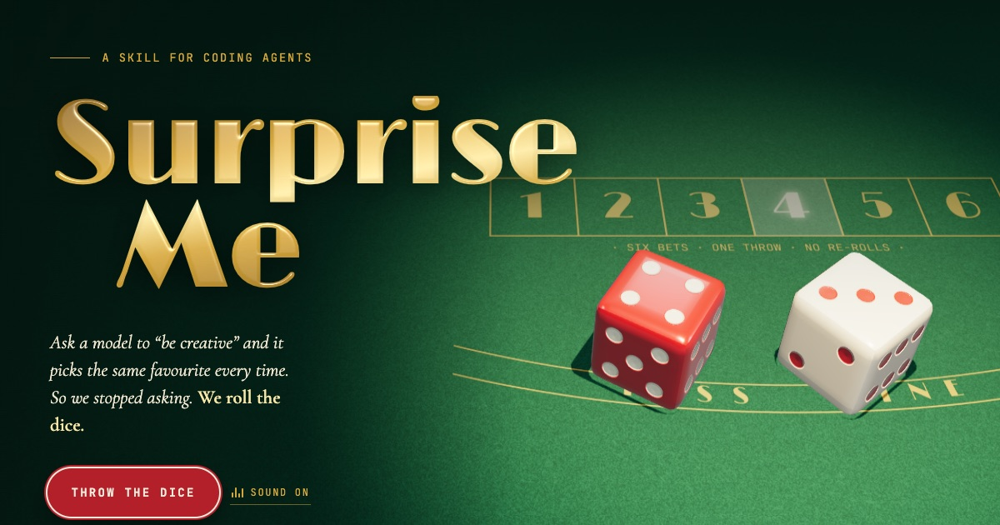

# surprise-me

[](https://zhoulinhua0-star.github.io/surprise-me/)

**[Live site →](https://zhoulinhua0-star.github.io/surprise-me/)** — built by the skill itself: it rolled a 1 (Las Vegas, 1974).

**Max visual acuity mode** — a cross-agent skill that makes coding agents (Claude Code, Codex, and anything else that reads `SKILL.md`) produce visual work meant to blow you away instead of serving the default style.

Asking a model to "be creative" changes the wording, not the concept — it picks the same favourite every time. This skill swaps vibes for mechanics:

1. **Dice-rolled direction** — the agent writes 6 fundamentally different directions, then a real shell random roll (`$RANDOM`) picks one.
2. **Written contract** — concept, palette, type pairing, 3+ advanced techniques, hero moment, and bans, locked in a file.
3. **Real assets** — generated/sourced images and motion, not CSS-gradient placeholders.
4. **3+ visual critique passes** — render → screenshot → audit against the contract → fix. Nothing is shown before pass 3.

See [`SKILL.md`](skills/surprise-me/SKILL.md) for the full workflow.

## Install

### Claude Code — as a plugin (recommended)

Inside Claude Code:

```
/plugin marketplace add zhoulinhua0-star/surprise-me
/plugin install surprise-me@surprise-me
```

Update later with `/plugin marketplace update surprise-me`.

### Any agent — as a plain skill

Clone once, then symlink the skill folder into each agent's skills directory:

```bash
git clone git@github.com:zhoulinhua0-star/surprise-me.git ~/Developer/surprise-me

# Claude Code (skip if you installed the plugin)
ln -s ~/Developer/surprise-me/skills/surprise-me ~/.claude/skills/surprise-me

# Codex
ln -s ~/Developer/surprise-me/skills/surprise-me ~/.codex/skills/surprise-me

# Other agents that read ~/.agents/skills
ln -s ~/Developer/surprise-me/skills/surprise-me ~/.agents/skills/surprise-me
```

Restart the agent so it picks up the new skill. `git pull` updates it everywhere.

> Use one method per agent. If Claude Code has both the plugin and the symlink, the skill shows up twice (`surprise-me` and `surprise-me:surprise-me`) — remove the symlink with `rm ~/.claude/skills/surprise-me`.

## Repo layout

```
.claude-plugin/
  plugin.json            # plugin manifest
  marketplace.json       # lets this repo act as its own plugin marketplace
skills/surprise-me/
  SKILL.md               # the skill itself (canonical copy)
SKILL.md -> skills/surprise-me/SKILL.md   # symlink for agents that read the repo root
site/                    # the landing page (deployed to GitHub Pages by .github/workflows/pages.yml)
```

## Use

```
/surprise-me
/surprise-me a landing page for my CLI tool
surprise me with a pitch deck for this project
```

Works best when the agent can take screenshots (Playwright, a headless browser, or a browser tool) and has access to an image-generation tool.

## Credits

Based on the "surprise-me" skill shown by Jay E (RoboNuggets), modeled on his "25 websites with Fable" prompt, and on the [impeccable.style research](https://impeccable.style/research).

## License

MIT
